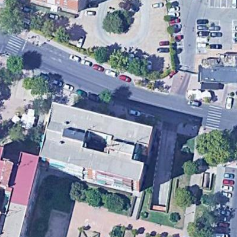
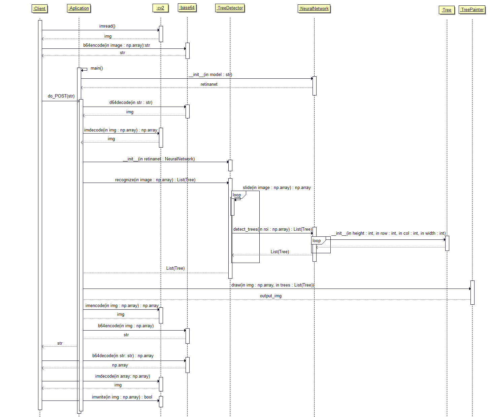

# Tree Detector

Tree Detector es un sistema de visión artificial que resolverá el problema de conteo de árboles, así como el de detectarlos y saber su radio desde imágenes aéreas.

<p align="center">
     
</p>

<p align="center">
     
</p>

El problema de detección de árboles en imágenes aéreas se ha enfocado como un problema de **detección de objetos**. Para ello, se probó con diversas redes de detección de objetos como son YOLO v3 y Faster R-CNN, pero fue con **RetinaNet** con la que se obtuvieron mejores resultados. Dicha red puede encontrarse en este [repositorio](https://github.com/fizyr/keras-retinanet).

Para el entrenamiento de RetinaNet se elaboró un dataset a partir de imágenes de Google Maps, que pueden encontrarse en el directorio ```images/train_images/```. Cada una de estas imágenes de entrenamiento va acompañada de su correspodiente archivo .xml con los árboles etiquetados. En el apartado 'Instalación del Repositorio' se proporciona un enlace para poder descargarse el modelo entrenado. 

Para programar la aplicación se ha seguido una programación orientada a objetos, cuyas clases pueden encontrarse en el directorio ```scr/```. El siguiente diagrama de secuencia muestra de forma gráfica el funcionamiento de la apliación:

<p align="center">
   
</p>

## Instalación del Repositorio

El equipo donde se quiera ejecutar el programa debe contar con:

* Python 3.6.x (comprobado en 3.6.13, posiblemente funcione en versiones posteriores)
* CUDA 11.2
* cuDNN v8.1.0 (January 26th, 2021), for CUDA 11.0, 11.1 and 11.2

Los pasos a seguir para la ejecución del programa son los siguientes:

**1.** Clonar este repositorio.

~~~
git clone https://github.com/pasensio97/AIVA_2021-imagenes_aereas
~~~

**2.** Crear entorno virtual con virtualenv en la carpeta clonada.

~~~
virtualenv --python=python3.6 venv && source venv/bin/activate
~~~

**4.** Instalar las librerías indicadas en el archivo requirements.txt.

~~~
python -m pip install -r requirements.txt
~~~

Es posible que de algún error por falta de librerías o módulos. Pero son fácilmente solucionables.

**5.** Navegar en la ventana de comandos(cmd) hasta la carpeta ```./AIVA_20201-imagenes_aereas/src```.

**6.** Una vez dentro del entorno virtual, ejecutar la siguiente línea:

~~~
python setup.py build_ext --inplace
~~~

**7.** Descargar el modelo entrenado del siguiente enlace y guardarlo dentro de la carpeta 'src/model'.

[Enlace a model.h5](https://urjc-my.sharepoint.com/:u:/g/personal/v_lomas_2020_alumnos_urjc_es/EacpLrcXskdKiNGxebzT-a0BuwnjOVyTQ0o0iaKJOjZzFQ?e=LYQbvI)

**8.** En este punto ya se tienen todas las depencencias necesarias para la ejecución del servidor ```aplication.py```, que es el encargado de realizar la detección de árboles.

~~~
python aplication.py
~~~

## Aplicación en Docker

La aplicación que se ha desarrollado sigue la arquitectura de servidor/cliente, en la que el cliente manda una imagen codificada en base64 mediante conexión HTTP al servidor (contenedor docker), que la procesa, realiza la detección de árboles y devuelve la imagen al cliente.

### Servidor

#### Servidor en Linux

Será necesario tener instalado:

* [Docker](https://www.docker.com/)
* [Nvidia-Docker](https://github.com/NVIDIA/nvidia-docker), para acelerar la ejecución de la aplicación con GPU.

~~~
docker run -it -p 8000:8000 --rm --gpus=all pasensio97/tree_detector_image python manage.py
~~~

#### Servidor en Windows

* [Docker](https://www.docker.com/)
* Nvidia-Docker no está disponible para Windows por lo que en este caso la aplicación se ejecutará en CPU.

~~~
docker run -it -p 8000:8000 --rm pasensio97/tree_detector_image python manage.py
~~~

### Cliente

Para mandar imágenes como cliente se utiliza el script ```client.py```. Allí se podrá encontrar de una forma detallada el envío de las imágenes al servidor. El script ```client.py``` admite dos argumentos de entrada: uno para indicar el directorio de la imagen de entrada(```--input```) y otro para indicar el directorio de la imagen de salida(```--output```).

~~~
python client.py --input img.png
~~~

~~~
python client.py --input input_image.png --output output_img.png
~~~

## Rendimiento del sistema

Para evaluar el rendimiento de la aplicación desarrollada se han calculado métricas, en particular la curva **Precision–Recall** y el valor de **Average Precision (AP)**, que son las métricas más populares que se utilizan para evaluar los modelos de detección de objetos. En concreto, se han utilizado las métricas que se utilizan en la conocida competición Pascal VOC, implementada en este [repositorio](https://github.com/rafaelpadilla/Object-Detection-Metrics).
Para ello, ha sido necesario realizar los siguientes pasos:

* Elaborar un conjunto de imágenes de test (no ‘vistas’ anteriormente por la red).

* Etiquetarlas manualmente para generar los archivos de ground truth para cada una de las imágenes de test.

* Pasar cada una de las imágenes de test por la red para obtener así los archivos con las detecciones realizadas.

* Calcular métricas a partir de los archivos de ground truth y las detecciones.

La curva **Precicion - Recall** obtenida ha sido la siguiente:

<p align="center">
  
</p>

Esta curva lo que expresa es como varían los valores de precisión y recall al ir variando el umbral de confianza. Un detector ideal es aquel para el que la precisión se mantiene alta a medida que aumenta el recall, es decir, un detector que tenga pocos Falsos Positivos(FP) y pocos Falsos Negativos(FN). En nuestro caso, como se puede observar, **el valor de precisión va disminuyendo a medida que el valor de recall aumenta**, lo que implica que para que se detecten el mayor número de árboles posibles, el valor de falsos positivos aumentará.

Por otro lado, el dato cuantitativo que refleja cómo de bueno es el detector de árboles desarrollado, viene dado por el valor de **Average Precision (AP)**, que representa el área bajo la curva Precision – Recall, que en este caso tiene un valor del **79,88%**.

A continuación se muestras varios ejemplos donde se comparan en una misma imagen las bounding boxes de ground truth (árboles etiquetados manualmente) y las bounding boxes de los árboles detectados por el modelo.

<p align="center">
  
</p>

<p align="center">
   
</p>
<p align="center">
   
</p>  
<p align="center">
   
</p>

Como puede comprobarse, **las detecciones realizadas por el modelo entrenado se aproximan bastante bien al ground truth**. Sin embargo, cuando hay varios árboles juntos las detecciones no son tan precisas, como puede verse en el segundo ejemplo anterior.

Cabe mencionar, que incluso para el ojo humano, es difícil determinar cuántos árboles hay de forma exacta en una imagen aérea, y más aún cuando hay varios árboles muy juntos.
Aun así, la aplicación desarrollada consigue dar una buena estimación de la posición y del número de árboles que hay en una imagen aérea.

## Trabajos Futuros

Consideramos que una posible lista de mejoras sobre este trabajo puede ser:

* Entrenamiento de la red con un dataset mayor y más variado al que hemos empleado. Teniendo en cuenta los árboles pelados.

* Paralelizar el procesamiento de las imágenes en TreeDetector._slice() para una mayor velocidad de la ya obtenida.
